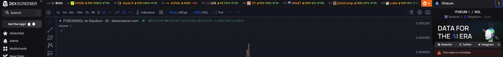

# 👋 Getting Started


Itheum is implementing deflationary tokenomics and conducting weekly $ITHEUM token burns triggered by increasing protocol usage. The aim is to increase token scarcity and align the token with our use case for agentic data tokenization and for the token to transition to it's governance utility.\
\
\> Read about the burn program here: [phase-1-token-burn-program.md](protocol/token-burning/phase-1-token-burn-program.md "mention")\
\> Follow the weekly burns on our X: [https://x.com/itheum](https://x.com/itheum)



On Oct 2025, the Itheum protocol upgraded to V3 (codename Itheum Aithra), which was a major re-focus and pivot.


## Itheum: Hyper-Digital, AGI-Ready Data

<figure><figcaption></figcaption></figure>

Since 2018, **Itheum** has been driven by one mission - to build a world where data is **owned, not extracted**.

Over the years, we’ve explored what data ownership means in practice: from healthcare and personal analytics to Data NFTs and privacy-first AI. Every product, every iteration has brought us closer to one realization - the world’s relationship with data is about to fundamentally change.

Today, we stand at the edge of a new era - the shift from **digital** to **hyper-digital** data.

For decades, data has been collected, centralized, and monetized by platforms. This “digital data” powered the web as we know it - but it’s now reaching its limits. AI has already consumed most of the world’s open data, and what comes next will demand a new kind of infrastructure - one that allows **humans and intelligent systems** to exchange data securely, transparently, and fairly.

**Hyper-digital data** represents this next evolution. It’s data that is **ownable, programmable, privacy-preserving, and verifiable**. It carries identity, rights, and value - not just information. It’s the foundation for a world where **humans and AI agents** coexist in shared digital ecosystems, both contributing to and benefiting from the data economy.

### Itheum provides the infrastructure for this new era.&#x20;

Our protocol serves as the **full-stack abstraction and unification layer** for tokenization, storage, encryption, and IP licensing - enabling data to move freely between people, platforms, and intelligent systems while preserving ownership and trust.

We believe that as the internet evolves, so too must its data.

And so, Itheum’s next major upgrade embraces this evolution - **it’s called Aithra.**

Let’s explore it.
