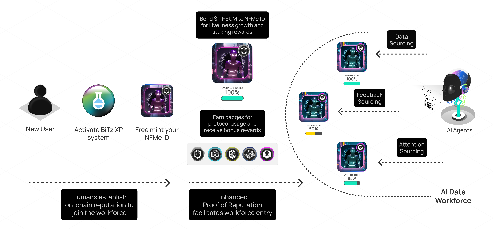

# 🚆 AI Data Workforce

### Introduction

Join the **AI Workforce** to prove your reputation, co-create new data with AI Agents, and unlock rewards.

We’re building a **community-driven ecosystem** where valuable data is created with AI. To grow this workforce, we’ve established a **reward system** with clearly defined **pathways** that show you how to contribute and get rewarded.

Your journey begins by claiming a free **NFMe ID** — the first step in your pathway to unlocking rewards and progressing toward greater opportunities.

<figure><figcaption></figcaption></figure>

### Reward Highlights

**Bond your $ITHEUM to NFMe IDs** to grow your Liveliness Score and earn staking rewards. You can earn APR up to 40% while staking on your NFMe ID.

<figure><figcaption></figcaption></figure>

**Earn rewards** by actively using the protocol and unlocking badges. Each badge reflects your participation and commitment to the AI Workforce.\

<figure><figcaption></figcaption></figure>

Let’s dive in and see how you can unlock rewards through our upgraded token utility. Start your journey and become a vital part of the AI Data Workforce.

