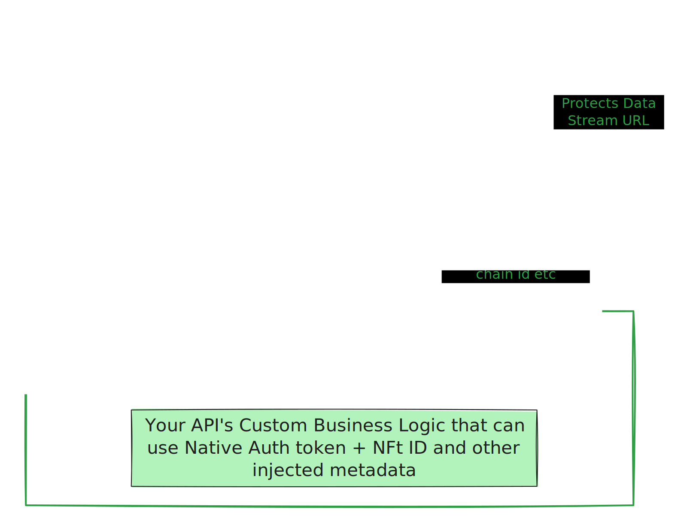

# MultiversX Native Auth Protected API


This guide is specific to using Itheum's Data NFTs in combination with the MultiversX Blockchain as it uses the Native Auth feature of MultiversX to authenticate backend services/APIs with a front-end wallet generated "token."


## Introduction

If you want a backend service or API that needs to be the Data Stream API for a single Data NFT or for an entire collection of Data NFTs part of [itheum-enterprise.md](../pre-aithra-r-and-d/itheum-enterprise.md "mention"), then this guide will provide you with a template and some steps to get you started fast.\
\
Here is how it works:



* An end-user requests access to open your Data Stream URL (i.e., your Native Auth authenticated API).
* The Native Auth token passes through the Itheum Data Marshal Network, which validates the user and also confirms Data NFT ownership.
* The Data Marshal network passes through the Native Auth token and other metadata like the owner-validated NFT ID (i.e., the Data NFT ID, chain ID, etc.)
* Your origin Data Stream API gets this request. You can then use the Native Auth token and all the injected metadata to personalize the response to the user.


**An example use-case:** Your origin Data Stream API can get the validated caller address and the validated Data NFT ID and use both these data points to provide real-time insights on the NFT history or behavior of the person who owns the NFT!


## Step 1: How does Native Auth protect my API?

Let's understand this first.\
\
Here is an example API endpoint that's Native Auth protected : [https://api.itheumcloud-stg.com/datadexapi/bespoke/dynamicSecureDataStreamDemo](https://api.itheumcloud-stg.com/datadexapi/bespoke/dynamicSecureDataStreamDemo)\
It's important to note that this example API gives you a `"Access Forbidden as this is a protected Data Stream. No credentials sent!"` message when you call it without an token like so:


```shell
curl --location 'https://api.itheumcloud-stg.com/datadexapi/bespoke/dynamicSecureDataStreamDemo'
```


Now, let's generate a sample Native Auth token and access the API again to test if it works.\
\
Head over to [https://utils.multiversx.com/auth](https://utils.multiversx.com/auth) and swap to "devnet" and click on "Generate". Connect your wallet and it should give you a sample token. Make sure the `Origin` is https://utils.multiversx.com and the `Time to live (seconds)` is 7200.&#x20;

<figure><figcaption></figcaption></figure>

Copy the token and use this as a `Bearer` token header in the API call:


```sh
curl --location 'https://api.itheumcloud-stg.com/datadexapi/bespoke/dynamicSecureDataStreamDemo' \
--header 'Authorization: Bearer ZXJk...d040b'
```


Now, the API will work! and the Origin Data Stream API will return a "personalized" data payload similar to this:


```json
{
    "data_stream": {
        "name": "private stream for erd1qmsq6ej344kpn8mc9xfngjhyla3zd6lqdm4zxx6653jee6rfq3ns3fkcc7",
        "creator": "Itheum",
        "created_on": 1692571700,
        "last_modified_on": 1692571710,
        "generated_on": 1705457606
    },
    "data": [
        {
            "txId": 1001,
            "category": "purchase",
            "date": 1692571701,
            "item": "Gold Watch",
            "store": "Nice jewellers",
            "meta": "https://some_session_to_full_meta_data_of_transaction?txId=1001&user=erd1qmsq6ej344kpn8mc9xfngjhyla3zd6lqdm4zxx6653jee6rfq3ns3fkcc7&session=ZXJkMXFtc3E2ZWozNDRrcG44bWM5eGZuZ2poeWxhM3pkNmxxZG00enh4NjY1M2plZTZyZnEzbnMzZmtjYzc.YUhSMGNITTZMeTkxZEdsc2N5NXRkV3gwYVhabGNuTjRMbU52YlEuMDIwYmUxZGQ4NzEzNDAyMmY1ZGU1ZjRhMjdhM2YwZTVjMjg2NDQ0OTM3NmNiM2E3MDI1Mjg0ZDY0YzgwYWNhYS43MjAwLmV5SjBhVzFsYzNSaGJYQWlPakUzTURVME5UYzJNVEI5.c111228b165df152282222e4bd6d897a47d24f1c7fa7766806253812cb62fb40e1757894ed1b54679c4fcc1e9437f8f7ff311cdf8f3e97db7f1defd4b9cd040b"
        }
    ],
    "metaData": {
        "data_marshal_injected": {
            "itm-marshal-fwd-chainid": "error, this value should be forwarded if Data NFT was opened",
            "itm-marshal-fwd-tokenid": "error, this value should be forwarded if Data NFT was opened"
        },
        "mvx_native_auth": {
            "decodedSession": {
                "ttl": 7200,
                "origin": "https://utils.multiversx.com",
                "address": "erd1qmsq6ej344kpn8mc9xfngjhyla3zd6lqdm4zxx6653jee6rfq3ns3fkcc7",
                "signature": "",
                "blockHash": "020be1dd87134022f5de5f4a27a3f0e5c2864449376cb3a7025284d64c80acaa",
                "body": "XXX.yyy.7200.zzz",
                "extraInfo": {
                    "timestamp": 1705457610
                }
            },
            "validateSession": {
                "issued": 1705457606,
                "expires": 1705464806,
                "address": "erd1qmsq6ej344kpn8mc9xfngjhyla3zd6lqdm4zxx6653jee6rfq3ns3fkcc7",
                "origin": "https://utils.multiversx.com",
                "extraInfo": {
                    "timestamp": 1705457610
                }
            }
        }
    }
}
```


* Notice how on `line 3`, it shows the user's address and the rest of the data stream is also personalized to the user's address used as a "identifier" to personalzied data
* Notice how on line 20, some headers like `itm-marshal-fwd-chainid` and `itm-marshal-fwd-tokenid` are missing which will be very useful for your API, not to worry - these headers will be injected by the Data Marshal Network.

Now that we understand how Native Auth can protect our API with an authentication/authorization layer and also give us key verified metadata about the calling user so that we can personalize our response - let's proceed to the next phase and learn how you can launch our own Native Auth Protected API that can be used as a Data NFT's Data Stream.

## Step 2: Build and Publish your Native Auth Protected API

1. If your existing API already supports MultiversX Native Auth, then you are good to go! Just make sure your API conforms to the other general [data-stream-url-rules.md](data-stream-url-rules.md "mention") in order to use it as a Data NFT's Data Stream
2. If your existing API does NOT support MultiversX Native Auth, you can use the following free open source templates we have published to wrap your existing API business Logic into the Native Auth Wrapper


A simple JavaScript Express.JS API Sample with Native Auth Support



A complex TypeScript Next.JS API Sample with Native Auth Support. This project cna be the base for very mature production ready APIs


The above API 2 templates can be used to build simple and complex APIs; the choice is yours as to which template you want to use. Or, you can use the templates to understand how to add Native Auth support and build it into your API projects.


Once your API is built as per above template and supports MultiversX Native Auth, then all you have to do is publish it to be publicly accessible you are good to go! Just make sure your API conforms to the other general [data-stream-url-rules.md](data-stream-url-rules.md "mention") in order to use it as a Data NFT's Data Stream


You can now use your Native Auth Protected Data Stream API URL as a Data Stream URL to mint new Data NFTs!
