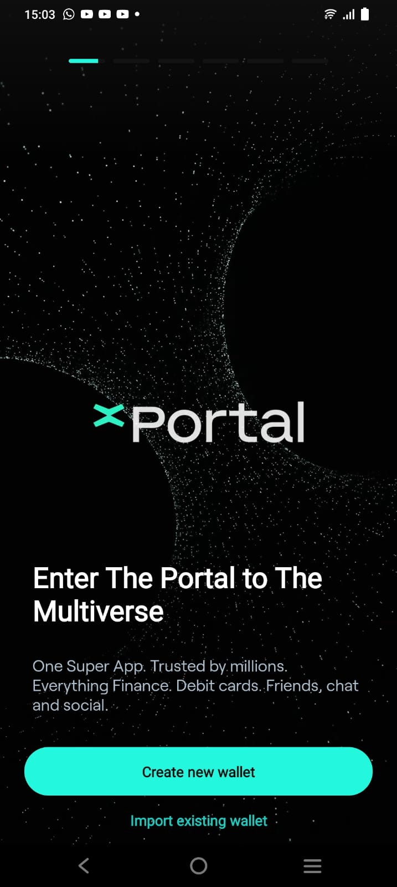
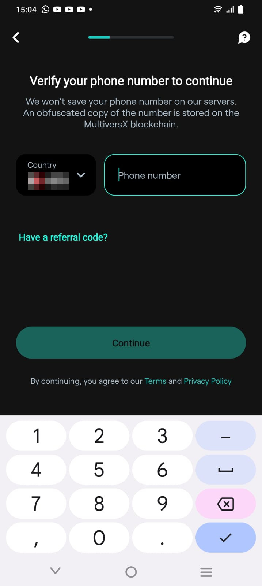
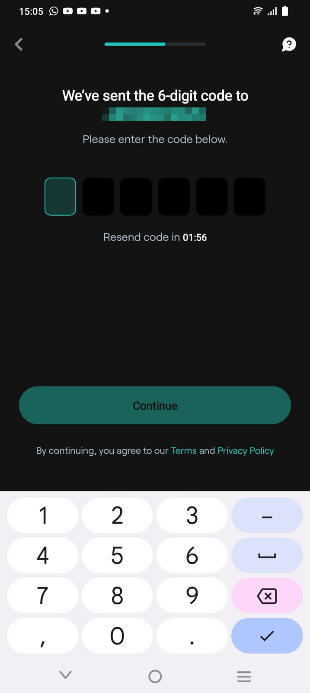
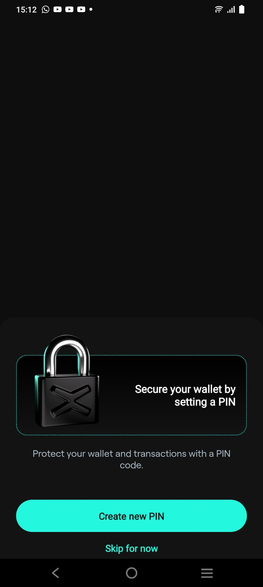

# xPortal Wallet

xPortal is an all-in-one app for crypto and finance. Securely store your crypto and NFTs, swap tokens, and use our upcoming debit cards with cashback rewards. It offers finance management, gamified missions, AI avatar creation, and global payments.

We will cover the installation of the xPortal App below.

**Prerequisites**

1. Install [xPortal App](https://xportal.com/app).

**Steps**

1. Open the App and click on "Create new wallet".

2. Enter your country and phone number.

3. You will receive an SMS with a 6-digit code. Enter this in the App.

4. Once the phone number is verified, click on "Create new PIN" and enter your Pin to secure your account.

5. Congratulations, your account has been created. Click on "Enter xPortal".

.jpg>)

6. You will be able to see the App dashboard.

.jpg>)

For further information please visit [https://docs.multiversx.com/wallet/xportal](https://docs.multiversx.com/wallet/xportal)
