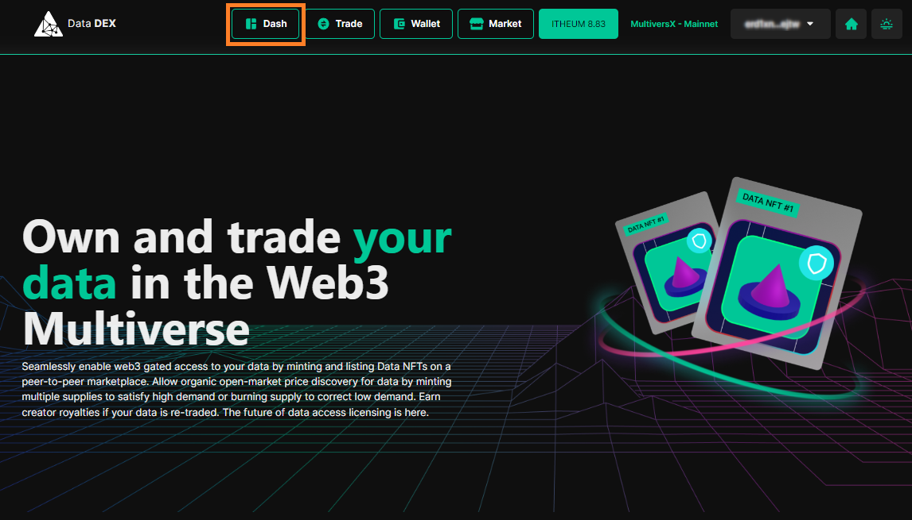

# Using the claims Portal

The Claims Portal is a critical component of Itheum's protocol, and its role is to oversee the automated token distributions that are the outcome of ecosystem usage activity. It facilitates direct token distribution schemes within the Itheum ecosystem, coordinating exchanges between Data Creators, Data Consumers, and Data Coalition DAOs. It enables the fair distribution of tokens among participants, making it a crucial building block for the Itheum platform's community growth and governance. You can learn more about the Claims Portal in this [blog post](https://medium.com/itheum-newsletter/itheums-token-distribution-nucleus-the-claims-portal-is-now-live-on-the-elrond-mainnet-e5717c3827b6).

In this guide, we will now run through the process of how to log into the Data DEX and self-claim and ITHEUM tokens allocated to you from the Claims Portal.

**Steps)**

1. Browse over to the Itheum [Data DEX](https://datadex.itheum.io/).
2. Click on "Connect MultiversX Wallet" and select "Mainnet".

<figure><figcaption></figcaption></figure>

3. Choose your wallet, in this instance, we will choose "Defi Wallet" (but you can choose any supported MultiversX Wallet)

<figure><figcaption></figcaption></figure>

4. Once logged in click on "Dash" to get to your dashboard.

<figure><figcaption></figcaption></figure>

5. Under "My Claims" you will be able to see amounts to be claimed from various categories, namely Rewards, Airdrops, Royalties, and Allocation if applicable.
6. Click on the amount for the category you wish to claim ITHEUM from.

<figure><figcaption></figcaption></figure>

7. &#x20;You will see a popup that provides details of the claim. Click on Claim Now.

<figure><figcaption></figcaption></figure>

8. Confirm the transaction in your wallet.

<figure><figcaption></figcaption></figure>

9. Once the transaction is concluded your wallet balance will be updated with the ITHEUM claimed.
