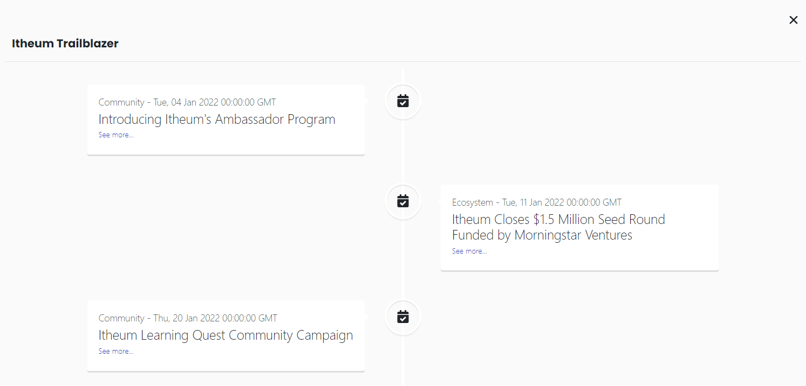

# 🎏 Trailblazer

<figure><figcaption></figcaption></figure>

The Trailblazer (TB) is a specialized Data NFT designed to leverage the capabilities of the Data NFT technology. It serves as a community engagement tool for organizations to interact with their users through exclusive events, campaigns, meetups, discounts, and more. The TB is minted within the Data NFT Marketplace. Organizations and projects can have their own Trailblazer.

The project or organization owning the Trailblazer Data NFT is provided with a CSV **template/structure/schema** whereby they will be able to update events and activities. The CSV is then processed and hosted via JSON in AWS as a data stream.


Further information can be found at [Data Streaming Automation - Trailblazer](../../integrators/data-streams-guides/amazon-web-services-aws/storage-aws-s3/data-nft-streaming-automation-trailblazer.md)


The Data NFT is then listed and made available for procurement from the Data NFT Marketplace. Upon procuring the Trailblazer Data NFT, the buyer now has gated access to the data stream. They can choose to view the raw data or visit the Trailblazer App on the Itheum Explorer and access a visual representation of the contents of the Data NFT.

### Workflow:

* Get [Whitelisted](https://datadex.itheum.io/getwhitelisted) to mint a Trailblazer Data NFT
* _Minting_: The organization mints a Trailblazer Data NFT specific to its brand or community within the Data NFT Marketplace
* _Data Format_: The Trailblazer Data NFT contains a specific format that communicates events and exclusive offerings to the TB holders
* _Data Visualization_: Within the Itheum Explorer, a dedicated app called the "Trailblazer App" is available to visualize the data from the Trailblazer; it renders the data in the form of an event timeline graph
* _Event Details:_ Each event in the JSON/CSV includes a title, event description, and a link to provide additional information or access to exclusive content

### Trailblazer App

<figure><figcaption></figcaption></figure>

Upon Launching the App the User will have access to:&#x20;

* _Data Visualization_: Within the "[Trailblazer App](https://explorer.itheum.io/project-trailblazer)" the user is able to visualize the JSON data from the Trailblazer; it renders the data in the form of an event timeline view
* _Event Details_: Each event in the JSON includes a title, event description, and a link to provide additional information or access to exclusive content

<figure><figcaption>
Share "Alpha" News direct to your TrailBlazer Holders
</figcaption></figure>

<figure><figcaption>
Launch exclusive Quests, Leaderboards and Campaigns "within" the TrailBlazer Data NFT
</figcaption></figure>

These could entail the below.

1. _Exclusive Quests_: Exclusive Quests are interactive adventures available only to TB holders. Users can participate in engaging quests to uncover hidden treasures, solve puzzles, or explore unique aspects of the organization's ecosystem.
2. _Exclusive Quizzes_: Exclusive Quizzes offer TB holders the opportunity to test their knowledge and gain insights about the organization or specific topics. Quizzes can cover a wide range of subjects related to the organization's industry, products, or community.
3. _Giveaway Campaigns_: Giveaway Campaigns provide TB holders with the chance to win prizes, including merchandise, physical products, and so on. These campaigns aim to reward and incentivize the TB community.
4. _Discount Campaigns_: Discount Campaigns offer TB holders exclusive access to discounts or promotional offers for products, services, or events related to the organization. These campaigns provide an opportunity for TB holders to enjoy exclusive perks.


Itheum's own Trailblazer Data NFT experience is directly [accessible here](https://explorer.itheum.io/project-trailblazer)

